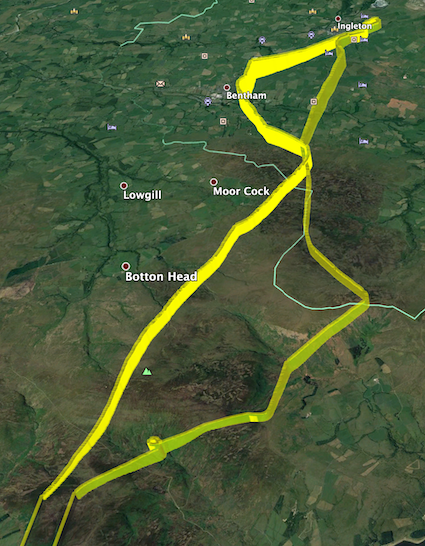
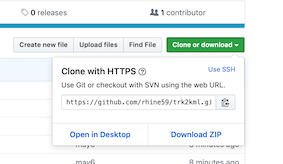
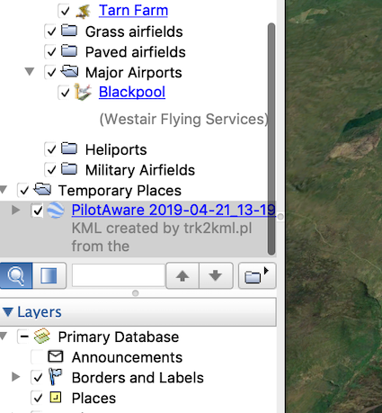

# A utility to convert PilotAware .trk files to Google Earth .kml files.

## Summary

A simple utility to take track data from the excellent PilotAware device https://pilotaware.com and extract data from the GGPGA records for use in Google Earth projections. PilotAware fora are to be found [HERE](http://forum.pilotaware.com/index.php).

Allows you to show where you have been using Google Earth to present the infromation from your PilotAware recorded route as in the example below.



## Getting started

Download the code using the links to the top right of the screen under this link - you can download and expand the .zip file or you can `git clone https://github.com/rhine59/trk2kml.git` if you prefer.



Add all of your .trk from your PilotAware device to the same directory as the `trk2kml.pl` file.

You will need Perl to run this script. Macs have this installed by default, but for a Windows machine, you can install it for free from such places as ActiveState @ https://www.activestate.com/products/activeperl/downloads/

There are other Perl distributions available so take your pick.

## How to use this script

You will need to open a Mac Terminal or a Windows Command Prompt.

Just run it as below and it will convert all of the PilotAware .trk files that it finds in the same directory as itself, into Google Earth .kml files.

See the example below.

```
rhine:trk2kml rhine$ ./trk2kml.pl
*INFO* Processing PilotAware track file 2018-07-06_15-25.trk
*INFO* Processing PilotAware track file 2018-10-28_11-33.trk
*INFO* Processing PilotAware track file 2018-08-03_08-03.trk
*INFO* Processing PilotAware track file 2018-07-27_08-59.trk
*INFO* Processing PilotAware track file 2019-01-23_14-20.trk
*INFO* Processing PilotAware track file 2019-04-11_11-56.trk
*INFO* Processing PilotAware track file 2018-08-05_09-32.trk
*INFO* Processing PilotAware track file 2018-07-21_13-03.trk
*INFO* Processing PilotAware track file 2018-08-05_10-26.trk
*INFO* Processing PilotAware track file 2019-04-21_13-19.trk
*INFO* Processing PilotAware track file 2018-08-04_10-33.trk
rhine:trk2kml rhine$

```

When complete, if you look at your working directory again, you will see a complimemtary set of `.kml` files which are the files used by Google Earth. Click [Here](https://en.wikipedia.org/wiki/Keyhole_Markup_Language) if you want to know more.

```
-rw-r--r--@ 1 rhine  staff  12702843  1 May 11:46 2019-04-21_13-19.trk
-rw-r--r--@ 1 rhine  staff   2785342  1 May 11:46 2019-04-11_11-56.trk
-rw-r--r--@ 1 rhine  staff   9685681  1 May 11:46 2019-01-23_14-20.trk
-rw-r--r--@ 1 rhine  staff  15780793  1 May 11:46 2018-10-28_11-33.trk
-rw-r--r--@ 1 rhine  staff   3667964  1 May 11:47 2018-08-05_10-26.trk
-rw-r--r--@ 1 rhine  staff   4862862  1 May 11:47 2018-08-05_09-32.trk
-rw-r--r--@ 1 rhine  staff   7402317  1 May 11:47 2018-08-04_10-33.trk
-rw-r--r--@ 1 rhine  staff   8066053  1 May 11:47 2018-08-03_08-03.trk
-rw-r--r--@ 1 rhine  staff   6445399  1 May 11:47 2018-07-27_08-59.trk
-rw-r--r--@ 1 rhine  staff   6348748  1 May 11:47 2018-07-21_13-03.trk
-rw-r--r--@ 1 rhine  staff   9131483  1 May 11:47 2018-07-06_15-25.trk
-rwxr-xr-x  1 rhine  wheel      2872  6 May 11:21 trk2kml.pl
drwxr-xr-x  3 rhine  wheel        96  6 May 11:31 videos
drwxr-xr-x  4 rhine  wheel       128  6 May 11:55 images
-rw-r--r--  1 rhine  wheel    138726  6 May 11:59 2018-07-06_15-25.kml
-rw-r--r--  1 rhine  wheel    235966  6 May 11:59 2018-10-28_11-33.kml
-rw-r--r--  1 rhine  wheel    155735  6 May 11:59 2018-08-03_08-03.kml
-rw-r--r--  1 rhine  wheel     96929  6 May 11:59 2018-07-27_08-59.kml
-rw-r--r--  1 rhine  wheel    160058  6 May 11:59 2019-01-23_14-20.kml
-rw-r--r--  1 rhine  wheel     43012  6 May 11:59 2019-04-11_11-56.kml
-rw-r--r--  1 rhine  wheel     74838  6 May 11:59 2018-08-05_09-32.kml
-rw-r--r--  1 rhine  wheel     96284  6 May 11:59 2018-07-21_13-03.kml
-rw-r--r--  1 rhine  wheel     54239  6 May 11:59 2018-08-05_10-26.kml
-rw-r--r--  1 rhine  wheel    190171  6 May 11:59 2019-04-21_13-19.kml
-rw-r--r--  1 rhine  wheel    107574  6 May 11:59 2018-08-04_10-33.kml
```

Now open Google Earth and use File > Open to select the `.kml` file you have created.



Early days, and there are some short cuts which need to be sorted.

# Some background information

## A sample of GPGGA records from the PilotAware track log.

Here is a sample of the records from the PilotAware log that I am using to create the .kml file. I think that they come from the FLARM protocol definitions, but the record details are documented in the links below.

```
$GPGGA,131911,5356.177,N,00251.218,W,1,04,7.0,7.2,M,49.2,M,,*5A
$GPGGA,131912,5356.178,N,00251.219,W,1,04,7.0,7.9,M,49.2,M,,*5C
$GPGGA,131913,5356.179,N,00251.219,W,1,04,7.0,8.0,M,49.2,M,,*5A

```

## A definition of the GPGGA record contents.

from ... https://www.gpsinformation.org/dale/nmea.htm

```
Decode of selected position sentences

The most important NMEA sentences include the GGA which provides the current Fix data, the RMC which provides the minimum gps sentences information, and the GSA which provides the Satellite status data.

GGA - essential fix data which provide 3D location and accuracy data.

 $GPGGA,123519,4807.038,N,01131.000,E,1,08,0.9,545.4,M,46.9,M,,*47

Where:
     GGA          Global Positioning System Fix Data
     123519       Fix taken at 12:35:19 UTC
     4807.038,N   Latitude 48 deg 07.038' N
     01131.000,E  Longitude 11 deg 31.000' E
     1            Fix quality: 0 = invalid
                               1 = GPS fix (SPS)
                               2 = DGPS fix
                               3 = PPS fix
			       4 = Real Time Kinematic
			       5 = Float RTK
                               6 = estimated (dead reckoning) (2.3 feature)
			       7 = Manual input mode
			       8 = Simulation mode
     08           Number of satellites being tracked
     0.9          Horizontal dilution of position
     545.4,M      Altitude, Meters, above mean sea level
     46.9,M       Height of geoid (mean sea level) above WGS84
                      ellipsoid
     (empty field) time in seconds since last DGPS update
     (empty field) DGPS station ID number
     *47          the checksum data, always begins with *`

```

Thanks, Richard Hine - UK
